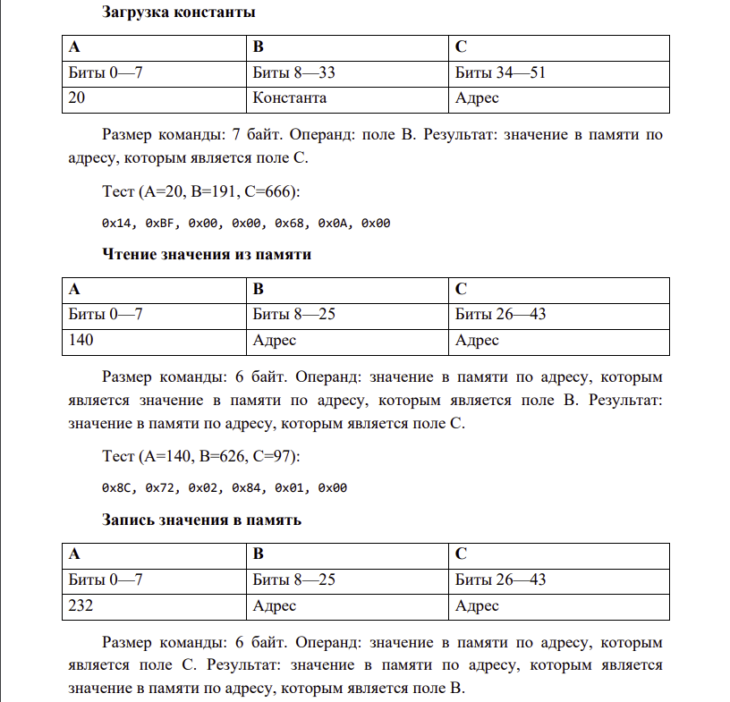
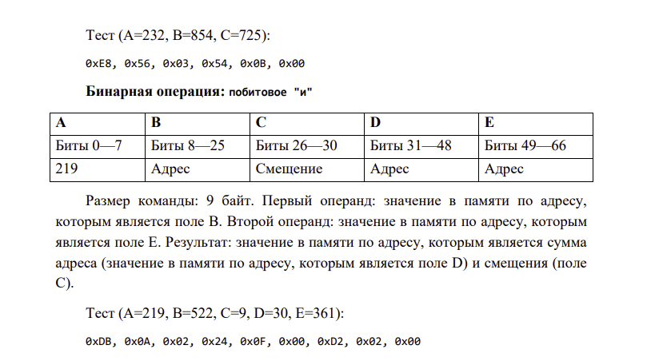
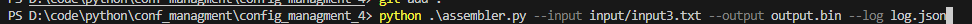
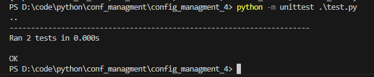
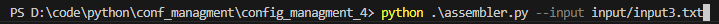
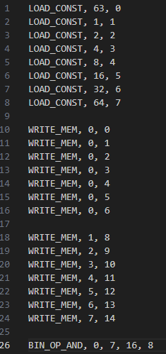
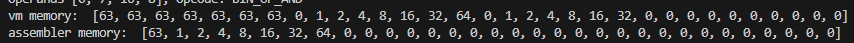
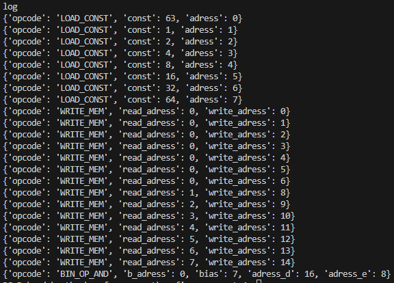

# Задача 4

Разработать ассемблер и интерпретатор для учебной виртуальной машины
(УВМ). Система команд УВМ представлена далее.
Для ассемблера необходимо разработать читаемое представление команд
УВМ. Ассемблер принимает на вход файл с текстом исходной программы, путь к
которой задается из командной строки. Результатом работы ассемблера является
бинарный файл в виде последовательности байт, путь к которому задается из
командной строки. Дополнительный ключ командной строки задает путь к файлулогу, в котором хранятся ассемблированные инструкции в духе списков
“ключ=значение”, как в приведенных далее тестах.
Интерпретатор принимает на вход бинарный файл, выполняет команды УВМ
и сохраняет в файле-результате значения из диапазона памяти УВМ. Диапазон
также указывается из командной строки.

Форматом для файла-лога и файла-результата является json.
Необходимо реализовать приведенные тесты для всех команд, а также
написать и отладить тестовую программу

## функции ассемблера

## Тестовая программа
Выполнить поэлементно операцию побитовое "и" над двумя векторами длины 7. Результат записать в новый вектор.

## Запуск программы

для запуска программы нужно вписать:
- входной файл `--input`
- выходной бинарный файл `--output`
- файл лога json `--log`

## Unitests
Программа проходит все юниттесты

## Тестирование функции `BIN_OP_AND`

Запуск тестового файла

Входной файл

Результат в памяти вм

Лог ассемблера

